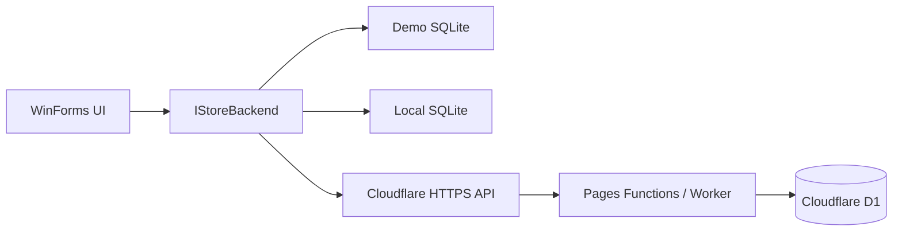

# Bike Store Desktop

A generic Windows desktop management application for electric bicycle retailers. It can run as a safe, resettable playground, use a persistent local SQLite database, or connect to an authenticated Cloudflare API.

## Data modes

| Mode | Storage | Intended use |
| --- | --- | --- |
| Demo | Seeded SQLite database in the current Windows user's app-data folder | Public experimentation and portfolio demonstrations |
| Local | User-selected SQLite file | A single offline computer or local store |
| Online | HTTPS API; the server accesses Cloudflare D1 | A deployed store such as CV Niaga Bersama |

The first launch asks which mode to use. The choice can later be changed from **Store settings** in the sidebar. Demo mode displays its test login on the sign-in screen and provides a **Reset demo data** action.



The desktop application never connects directly to D1 and never stores a Cloudflare API credential. An online session uses the store's normal username/password login and keeps the returned bearer token in memory only for the lifetime of the session.

## Generic store profiles

Non-secret profile settings are stored in:

```text
%LOCALAPPDATA%\BikeStoreDesktop\store-profile.json
```

A profile controls:

- Store and profile names
- Short sidebar mark
- Backend mode and local database path or HTTPS API base URL
- Culture, currency formatting, invoice title, and low-stock threshold

CV Niaga Bersama is an online profile rather than hard-coded application behaviour. Window titles, sidebar branding, printed invoice/report headings, and money formatting use the active profile.

## Current workflow

Demo and Local modes retain the complete desktop workflow:

- Unified role-aware dashboard
- Website-compatible bicycle catalogue with per-colour variants
- Dedicated **Tambah Stok** workflow for existing and new colours
- FIFO stock lots and movement history
- Multi-item invoices, frame numbers, payments, A5 printing, editing and void restoration
- Service intake, status workflow, history and A4 printing
- Sales, service, gross-profit, payment, product and stock reports
- User/role administration and audit activity

Online mode currently routes authentication, catalogue, colour variants, stock changes and catalogue status through the existing website API. Local-only pages are hidden in this mode instead of silently reading or writing a different SQLite file. The backend contract is the extension point for moving the remaining desktop screens onto the website's existing invoice, service, report, user and audit endpoints.

## Inventory model

Local storage preserves FIFO costing. Every receipt creates a `stock_lots` row; invoice sales consume the oldest remaining lots first and record allocations in `sale_lines`. The website-compatible `bikes.colors` JSON shape remains the catalogue-facing stock representation.

Main local tables:

- `bikes`, `brands`, `products`
- `stock_lots`, `stock_movements`
- `invoices`, `invoice_items`, `invoice_sequences`
- `sales`, `sale_lines`
- `services`
- `users`, `audit_log`

Existing databases are upgraded additively during startup; legacy product, sales, service, stock-lot and user records are retained.

## Test credentials

New Demo and Local databases seed this administrator account:

```text
Username: admin
Password: admin123
```

Change the password before using a Local profile operationally. Online profiles use accounts from the connected Cloudflare store.

## Run

Requirements:

- Windows 10 or later
- .NET 8 SDK

```powershell
git clone https://github.com/jason1511/Bike-STore-Project.git
cd Bike-STore-Project
dotnet restore
dotnet run
```

The repository includes a Windows GitHub Actions build for pushes and pull requests targeting `master`.
