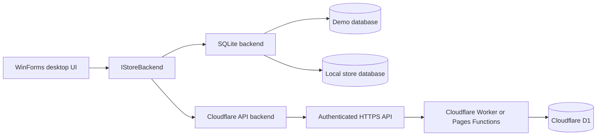

# Bike Store Desktop

[](https://github.com/jason1511/Bike-STore-Project/actions/workflows/build.yml)
[](https://dotnet.microsoft.com/)
[](LICENSE)

A configurable Windows desktop application for running an electric bicycle store. It combines catalogue and colour-variant management, FIFO inventory, sales invoices, service jobs, reporting, users and an audit trail in one C# WinForms application.

The project began as an internal tool for CV Niaga Bersama Abadi. It now has three selectable store profiles so the repository can also be used as a safe demo, a standalone offline system, or a desktop client for an online store.

## What the application does

The normal Demo or Local workflow is:

1. Configure a store profile and sign in.
2. Create bicycle models and their available colour variants.
3. Use **Tambah Stok** to receive a new batch for an existing colour or add a new colour to a bicycle.
4. Create a multi-item sales invoice. Stock is allocated from the oldest available purchase lots first.
5. Print the A5 customer invoice, or manage service jobs and print an A4 service document.
6. Review stock movements, revenue, service income, gross profit and user activity from the administration screens.

The application uses the same bicycle → colour → stock flow as the Bike Store Website while retaining desktop-specific FIFO purchase-cost tracking for local accounting.

## Quick start

### Requirements

- Windows 10 or later
- [.NET 8 SDK](https://dotnet.microsoft.com/download/dotnet/8.0)

```powershell
git clone https://github.com/jason1511/Bike-STore-Project.git
cd Bike-STore-Project
dotnet restore
dotnet run
```

On first launch, select **Try the demo**, save the profile, and sign in with:

```text
Username: admin
Password: admin123
```

These credentials belong only to the resettable demo database stored on your computer. The demo does not connect to CV Niaga Bersama or any production data.

## Choose a storage mode

| Mode | Storage | Available workflow | Intended use |
| --- | --- | --- | --- |
| **Demo** | Seeded SQLite database | Complete desktop workflow | Evaluation, screenshots and experimentation |
| **Local** | Persistent SQLite file | Complete desktop workflow | One offline computer or a small store |
| **Online** | Authenticated HTTPS API | Catalogue, colour variants and stock quantity | A deployed store backed by Cloudflare |

The current profile and backend mode remain visible in the application. In Online mode, local-only screens are hidden so cloud records cannot be mixed accidentally with a SQLite database.

You can change modes from **Store settings**. The application restarts after applying a different profile.

## Application workflow

### 1. Store setup and login

The first-run setup collects the store name, sidebar abbreviation, language/currency, invoice title and low-stock threshold. Depending on the selected mode, it also stores either a SQLite file path or an HTTPS API base URL.

Demo and Local users are authenticated against the local `users` table. Passwords are stored as PBKDF2 hashes. Online users sign in through the connected store's `/api/admin/login` endpoint; the returned bearer token is kept in memory only until sign-out or application exit.

### 2. Catalogue and colour variants

A bicycle is the parent catalogue record. Each bicycle can contain multiple colour variants, with each colour carrying its own display details and available quantity.

From **Bicycles & stock**, users can:

- Search the catalogue by brand, model or colour
- Add a bicycle with its initial colour variant
- Edit bicycle and colour information
- Activate or deactivate catalogue entries according to permissions
- Open the dedicated **Tambah Stok** workflow

### 3. Receiving stock

**Tambah Stok** handles both stock scenarios without forcing users through the general bicycle editor:

- Select an existing colour to increase its stock.
- Enter a new colour to add that variant and its first stock quantity.

In Demo and Local modes, every receipt creates a FIFO `stock_lots` record containing the received quantity, remaining quantity, purchase cost and receipt time. A corresponding `stock_movements` entry provides an auditable stock history.

Online mode sends the colour and quantity update through the authenticated Cloudflare API. FIFO purchase-cost lots are currently a local desktop capability and are not claimed by the Online adapter.

### 4. Sales and invoices

The local invoice workflow supports multiple bicycles in one transaction. For each line, the user selects a bicycle/colour, quantity, selling price and optional frame numbers. Customer and payment details are stored on the invoice.

When an invoice is saved:

1. Available stock is validated.
2. The oldest stock lots are consumed first.
3. Each allocation and its purchase-cost snapshot is recorded in `sale_lines`.
4. Invoice items and stock movements are written in the same database transaction.
5. The invoice can be previewed and printed in A5 format.

Administrators can edit invoice details, void an invoice and restore its stock, or delete an obsolete record. Voiding preserves the history and records the stock restoration.

### 5. Service jobs

Service intake records the customer, bicycle, complaint/work details, cost and status. Staff can create and print service documents; administrators can update status, edit details or remove records. Open jobs appear on the dashboard until completed or cancelled.

### 6. Dashboard and administration

The local dashboard provides:

- Today's sales and invoice count
- Open service jobs
- Total and low-stock units
- Estimated gross profit from recorded FIFO costs
- Seven-day sales and stock-movement charts
- Recent invoices and active service jobs

Administrator-only screens cover brands, stock movements, date-range reports, user accounts and the audit trail. Staff retain day-to-day catalogue, stock receipt, invoice and service access without destructive or account-management permissions.

## Roles and permissions

| Capability | Staff | Administrator |
| --- | :---: | :---: |
| View, add and edit the catalogue | Yes | Yes |
| Receive stock or add a colour | Yes | Yes |
| Create and print invoices | Yes | Yes |
| Create and print service jobs | Yes | Yes |
| Deactivate or reactivate catalogue records | No | Yes |
| Edit/void invoices and restore stock | No | Yes |
| Edit service history and status | No | Yes |
| Manage brands and users | No | Yes |
| View reports, movements and audit activity | No | Yes |

New Demo and Local databases create the starter administrator shown in Quick start. Change that password before using a Local profile operationally. Online permissions come from the connected server.

## Architecture



`IStoreBackend` defines store operations instead of exposing SQL to the interface. Demo and Local profiles use `SqliteStoreBackend`; Online profiles use `CloudflareStoreBackend`.

The desktop application never connects directly to D1. It sends authenticated HTTPS requests to the store API, and only the server-side Worker or Pages Functions can access the D1 binding.

### Current backend coverage

| Operation | Demo/Local | Online |
| --- | :---: | :---: |
| Login | Yes | Yes |
| Browse and search bicycles | Yes | Yes |
| Add/edit bicycles and colours | Yes | Yes |
| Receive stock quantity | Yes | Yes |
| FIFO purchase-cost tracking | Yes | No |
| Invoices, service, reports and users | Yes | Planned |

This boundary is intentional: incomplete cloud modules remain hidden instead of silently writing to a local database. Hybrid/offline synchronisation is deferred until conflict, retry and idempotency rules are fully defined.

## Local database model

| Area | Main tables | Purpose |
| --- | --- | --- |
| Catalogue | `brands`, `bikes`, `products` | Bicycle models and sellable colour variants |
| Inventory | `stock_lots`, `stock_movements` | FIFO receipt batches and stock history |
| Sales | `invoices`, `invoice_items`, `invoice_sequences`, `sales`, `sale_lines` | Printable invoices, line items and FIFO allocations |
| Service | `services` | Service intake, progress and history |
| Administration | `users`, `audit_log` | Accounts, roles and traceable actions |

Database initialisation is additive. Existing records are retained while missing tables, columns and indexes are created. Related inventory and invoice writes use SQLite transactions to avoid partial updates.

## Configuration and data locations

Non-secret profile settings are saved to:

```text
%LOCALAPPDATA%\BikeStoreDesktop\store-profile.json
```

Default databases are stored beside that file as `demo.db` and `store.db`. A Local profile may point to another `.db` file selected during setup.

The profile file may contain the online server address, but it does not contain the user's password, bearer token, Cloudflare credentials, D1 database ID or Cloudflare API token.

To restore the sample dataset, open **Store settings → Reset demo data**. This deletes only the isolated demo database and recreates it on the next start.

## Technology

- C# and .NET 8
- Windows Forms
- Microsoft.Data.Sqlite
- SQLite transactions and FIFO stock allocation
- `HttpClient` and `System.Text.Json` for the online adapter
- Cloudflare Workers/Pages Functions and D1 for the CV Niaga Bersama deployment
- GitHub Actions on `windows-latest`

## Repository structure

```text
Backends/            Backend contract plus SQLite and Cloudflare adapters
Configuration/       Store profiles, application paths and saved settings
Core/                Session, permissions, hashing, prompts and formatting
Data/
  Models/            Catalogue, invoice and user data objects
  Repositories/      SQLite queries and transactional business operations
UI/
  Controls/          Dashboard, online overview, charts and shared theme
  Dialogs/           Bicycle and stock workflow dialogs
  Forms/             Setup, login and operational/admin screens
Program.cs           Startup, profile selection and dependency configuration
```

The dashboard is the single application shell. Obsolete alternative catalogue, product editor, sales, service-log and transaction-log forms were removed so new work has one clear implementation path.

## Build verification

Every push and pull request targeting `master` is restored and built on Windows:

```powershell
dotnet restore "Bike STore Project.sln"
dotnet build "Bike STore Project.sln" --configuration Release --no-restore
```

## Project status

- Demo workflow: available
- Complete Local SQLite workflow: available
- Online login, catalogue and stock quantity workflow: available
- Remaining Online desktop modules: planned
- Hybrid/offline synchronisation: intentionally deferred

## License

This project is available under the [MIT License](LICENSE).
