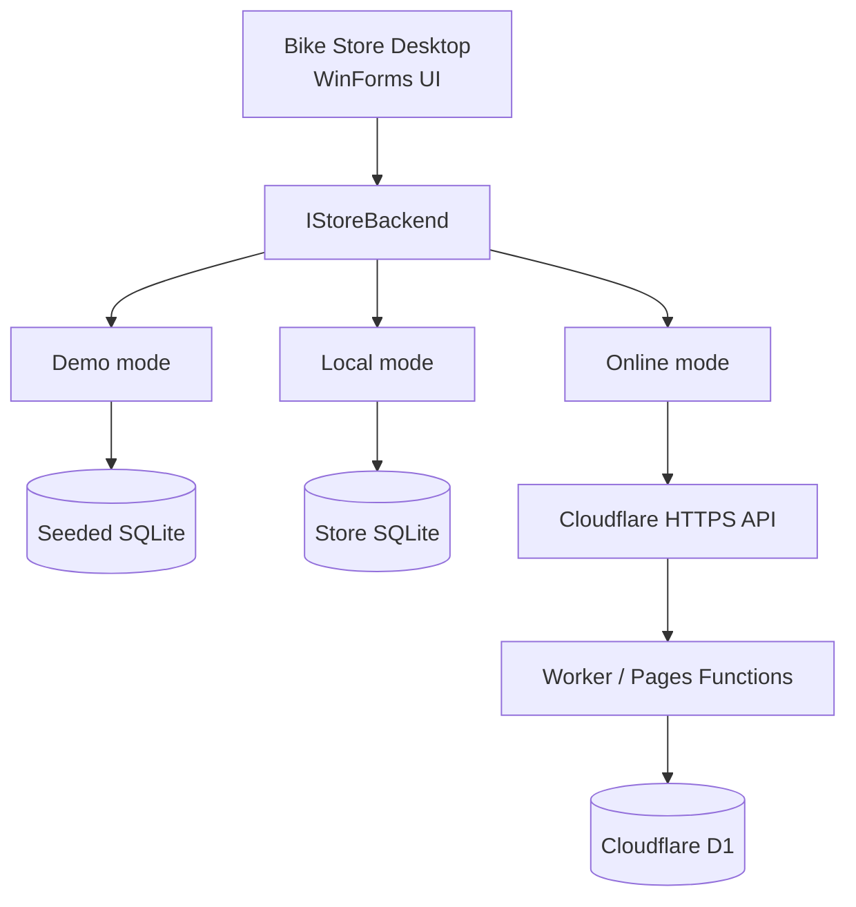

# Bike Store Desktop

[](https://github.com/jason1511/Bike-STore-Project/actions/workflows/build.yml)
[](https://dotnet.microsoft.com/)
[](LICENSE)

A configurable Windows desktop management system for electric bicycle retailers, built with C# WinForms and .NET 8.

The project began as a local tool for CV Niaga Bersama Abadi and has been redesigned so anyone can safely explore it. The same application can use seeded demonstration data, a persistent local SQLite database, or an authenticated online store API backed by Cloudflare Workers and D1.

## Try it quickly

Requirements:

- Windows 10 or later
- [.NET 8 SDK](https://dotnet.microsoft.com/download/dotnet/8.0)

```powershell
git clone https://github.com/jason1511/Bike-STore-Project.git
cd Bike-STore-Project
dotnet restore
dotnet run
```

On first launch, choose **Try the demo**. The application creates an isolated sample database in your Windows user profile.

```text
Username: admin
Password: admin123
```

Demo data can be restored at any time from **Store settings → Reset demo data**. It never connects to CV Niaga Bersama or another production database.

## Storage modes

| Mode | Data location | Best for |
| --- | --- | --- |
| **Demo** | Resettable, seeded SQLite database | Exploring the application and portfolio demonstrations |
| **Local** | User-selected persistent SQLite file | A single offline computer or small store |
| **Online** | Authenticated HTTPS API | A deployed store using Cloudflare Workers and D1 |

The selected mode is always visible in the application. Local-only screens are hidden while connected online, preventing the desktop client from accidentally mixing cloud records with a local database.

## Features

### Demo and Local

- Unified dashboard with role-aware navigation
- Bicycle catalogue organised by model and colour variant
- Dedicated **Tambah Stok** workflow for existing or new colours
- FIFO stock lots, purchase-cost snapshots and stock-movement history
- Multi-item sales invoices with customer, payment and frame-number details
- A5 invoice preview and printing
- Invoice editing, voiding and automatic stock restoration
- Service intake, status tracking, history and A4 printing
- Sales, service, gross-profit, payment, product and stock reports
- Administrator and staff accounts with PBKDF2 password hashing
- User management and audit activity

### Online

- Login through the connected store's existing account system
- Load, create and edit bicycle models through the Cloudflare API
- Manage colour variants and their stock quantities
- Add stock to an existing colour or introduce a new colour
- Activate or deactivate catalogue entries according to role permissions

Invoices, services, reports, users and audit activity remain complete in Demo/Local mode. Their desktop Online adapters are the next cloud-parity stage; the website already exposes the corresponding authenticated endpoints.

## Architecture



`IStoreBackend` describes application operations rather than exposing SQL. This allows local transactions to remain inside the SQLite implementation while online operations remain inside the server API.

The desktop application does not connect directly to D1. In Online mode it sends authenticated HTTPS requests to the store's Worker/Pages Functions API; only that server can access the D1 binding.

## Configurable store profiles

The first-run setup and **Store settings** screen configure:

- Profile and store names
- Short sidebar mark
- Demo, Local or Online backend
- SQLite file location or HTTPS API base URL
- Culture and currency formatting
- Printed invoice title
- Low-stock threshold

Non-secret settings are saved to:

```text
%LOCALAPPDATA%\BikeStoreDesktop\store-profile.json
```

Online passwords are not saved. The API bearer token is held in memory only until sign-out or application exit. Cloudflare account credentials, D1 identifiers and API tokens are never required by the desktop client.

## Inventory and database model

The local workflow keeps the website-compatible bicycle and colour structure while preserving FIFO costing:

1. A bicycle contains one or more colour variants.
2. Each local stock receipt creates a `stock_lots` batch with quantity, purchase cost and receipt time.
3. A sale consumes the oldest available lots first.
4. `sale_lines` records each FIFO allocation and its cost snapshot.
5. `stock_movements` records receipts, adjustments, sales and void restorations.

Main local tables:

| Area | Tables |
| --- | --- |
| Catalogue | `bikes`, `brands`, `products` |
| Inventory | `stock_lots`, `stock_movements` |
| Sales | `invoices`, `invoice_items`, `invoice_sequences`, `sales`, `sale_lines` |
| Service | `services` |
| Administration | `users`, `audit_log` |

Database startup is additive: existing desktop records are retained while missing tables, columns and indexes are created automatically.

## Roles

| Capability | Staff | Administrator |
| --- | :---: | :---: |
| View and edit catalogue | Yes | Yes |
| Receive stock | Yes | Yes |
| Create and print invoices/services | Yes | Yes |
| Deactivate catalogue entries | No | Yes |
| Void invoices and restore stock | No | Yes |
| Manage brands and users | No | Yes |
| View reports and audit activity | No | Yes |

New Demo and Local databases create the starter administrator shown above. Change its password before operational use. Online profiles use accounts and permissions from the connected server.

## Technology

- C# and .NET 8
- Windows Forms
- Microsoft.Data.Sqlite
- SQLite for Demo and Local storage
- `HttpClient` and JSON for the Cloudflare adapter
- Cloudflare Workers/Pages Functions and D1 for the CV Niaga Bersama deployment
- GitHub Actions using `windows-latest`

## Project status

- Demo mode: available
- Complete local-store workflow: available
- Cloudflare login and catalogue/stock workflow: available
- Remaining desktop cloud adapters: planned
- Hybrid/offline synchronisation: intentionally deferred until conflict and retry rules are defined

## Build verification

Every push and pull request targeting `master` restores and builds the solution on Windows:

```powershell
dotnet restore "Bike STore Project.sln"
dotnet build "Bike STore Project.sln" --configuration Release --no-restore
```

## License

This project is available under the [MIT License](LICENSE).
