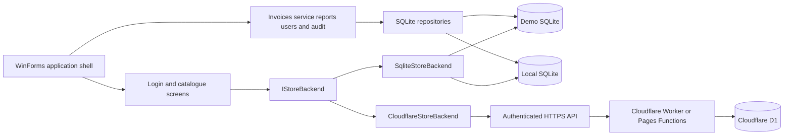

# Bike Store Desktop

[](https://github.com/jason1511/Bike-STore-Project/actions/workflows/build.yml)
[](https://dotnet.microsoft.com/)
[](LICENSE)

Bike Store Desktop is a configurable C# WinForms application for managing an electric bicycle store. It can run as a resettable demo, use a persistent local SQLite database, or connect its catalogue and stock screens to an online store API.

The application follows the Bike Store Website catalogue model: a bicycle is the parent record and each bicycle contains one or more colour variants. Local mode extends that model with FIFO purchase lots, invoicing, service jobs, reporting, users, and an audit trail.

## Current status

| Workflow | Demo | Local SQLite | Online API |
| --- | :---: | :---: | :---: |
| Login | Yes | Yes | Yes |
| Bicycle catalogue and search | Yes | Yes | Yes |
| Bicycle and colour editing | Yes | Yes | Yes |
| Receive stock or add a colour | Yes | Yes | Yes |
| FIFO purchase-cost lots | Yes | Yes | No |
| Sales invoices and stock allocation | Yes | Yes | Not implemented |
| Service jobs | Yes | Yes | Not implemented |
| Dashboard, reports, users, and audit | Yes | Yes | Not implemented |

Online mode deliberately hides local-only screens. The application never falls back to a local database for an unsupported online operation, so cloud and local records cannot be mixed accidentally.

## Quick start

### Requirements

- Windows 10 or later
- [.NET 8 SDK](https://dotnet.microsoft.com/download/dotnet/8.0)

```powershell
git clone https://github.com/jason1511/Bike-STore-Project.git
cd Bike-STore-Project
dotnet restore "Bike STore Project.sln"
dotnet run --project "Bike STore Project.csproj"
```

### First launch

1. Select **Demo**, **Local SQLite**, or **Online API**.
2. Enter the store profile and display details.
3. For Local mode, choose a SQLite file. For Online mode, enter a valid HTTPS store URL and optionally check the connection.
4. Choose **English** or **Bahasa Indonesia**. This language is used throughout setup, login, operations, validation messages, reports, and printed documents.
5. Select **Save and continue**.
6. Sign in.

For a new Demo or Local database, the app creates the `admin` account with a random first-run password. The password is shown on the first login screen for that database; copy it before closing the application. After signing in, an administrator can reset passwords from **Users**.

Resetting Demo data deletes only the isolated demo database. The sample data and a new administrator password are generated on the next start.

## Store profiles

### Demo

- Uses `%LOCALAPPDATA%\BikeStoreDesktop\demo.db`.
- Seeds safe sample bicycles and stock.
- Supports the complete local workflow.
- Can be reset from **Store settings**.
- Never connects to the production website or Cloudflare.

### Local SQLite

- Uses `%LOCALAPPDATA%\BikeStoreDesktop\store.db` by default.
- Can point to another SQLite file selected during setup.
- Supports the complete desktop workflow.
- Validates the database path and opens the file before saving the profile.
- Intended for one computer, an offline store, or development against local data.

### Online API

- Stores only the HTTPS base URL as part of the profile.
- Authenticates through the connected store server.
- Supports catalogue, colour variants, active status, and stock quantity.
- Keeps the bearer token in memory until sign-out or application exit.
- Does not store the user's password, bearer token, Cloudflare token, D1 ID, or D1 credentials in the profile file.

The CV Niaga Bersama preset currently uses `https://niagabersama.com`. The desktop app talks to the server API; it never connects directly to D1.

## Application workflow

### 1. Set up and sign in

The Store Setup screen collects:

- Profile name
- Store name and short sidebar name
- Language and currency
- Invoice title
- Low-stock warning level
- SQLite path or online API URL, when required

Saved settings are loaded at startup. If the settings file is missing or unreadable, the app opens Store Setup instead of silently continuing with the wrong database. If a selected profile cannot be opened, the user can correct it and retry.

Demo and Local accounts are stored in SQLite with PBKDF2 password hashes. Online login uses `POST /api/admin/login`, and the returned server role is mapped to Administrator or Staff.

### 2. Manage bicycles and colours

Open **Bicycles & stock** to:

- Search by brand, model, or colour
- Add a bicycle and its initial colour variants
- Edit specifications, selling price, visibility, images, and colours
- View total stock across all colours
- Deactivate or reactivate a bicycle as an administrator

The bicycle editor matches the website-shaped catalogue fields, including brand, model, battery, motor, speed, range, safety, images, description, featured state, and a list of colour objects.

### 3. Receive stock

Select **Receive stock** from **Bicycles & stock**.

1. Choose a bicycle.
2. Select an existing colour or add a new colour.
3. Enter the received quantity.
4. In Demo or Local mode, enter the unit purchase cost, receipt time, and optional reference notes.
5. Confirm the receipt.

In Demo and Local modes, the receipt creates a `stock_lots` batch and a `stock_movements` entry. The lot retains its purchase cost and remaining quantity for FIFO allocation. Online mode sends the updated colour quantity through the authenticated API and does not claim local FIFO cost support.

### 4. Create and manage invoices

Invoices are available in Demo and Local modes.

1. Add one or more bicycle/colour items.
2. Enter quantity, selling price, and optional frame numbers for each line.
3. Enter customer, payment, and invoice details.
4. Select **Save invoice** or **Save and print invoice**.

Saving an invoice runs in one SQLite transaction:

1. Available stock is checked.
2. The oldest available stock lots are consumed first.
3. Cost and selling-price snapshots are written to `sale_lines`.
4. Invoice items and outgoing stock movements are recorded.
5. The invoice becomes available in history and can be printed in A5 format.

Administrators can edit invoice metadata, void an invoice and restore its allocated stock, or delete an obsolete invoice record. A print-preview failure does not turn a successfully saved invoice into a failed sale.

### 5. Manage service jobs

The Service screen records customer and bicycle details, the requested work, notes, cost, and job status. Staff can create and print service documents. Administrators can edit service history, update status, or delete a record.

Supported statuses are **Received**, **In progress**, **Completed**, and **Cancelled**. Open service jobs appear on the local dashboard.

### 6. Review operations

The Demo and Local dashboard shows:

- Today's sales and invoice count
- Open service jobs
- Total and low-stock units
- Estimated gross profit from FIFO costs
- Seven-day sales and stock-movement charts
- Recent invoices and active service jobs

Administrator navigation also provides:

- **Brands** — add, rename, activate, or deactivate brands
- **Stock movements** — review receipts, sales, adjustments, and void restorations
- **Reports** — filter sales, service income, gross profit, and stock in/out by date and print the report
- **Users** — create accounts, reset passwords, change roles, enable/disable, or delete users
- **Activity** — review the audit trail and the signed-in actor for important changes

### 7. Switch profiles or sign out

Use **Store settings** in the sidebar to change the profile. The application restarts after saving so every screen is rebuilt against the selected backend. **Sign out** clears the current session; Online mode also clears its in-memory bearer token.

## Localization

The interface supports English (`en-US`) and Bahasa Indonesia (`id-ID`). The selected culture is stored in the active store profile and applied before any forms or backend services are created. Changing the language in **Store settings** takes effect after the application restarts.

All user-facing application text is kept outside the forms and business logic:

```text
Resources/Strings.resx       English source strings and fallback catalog
Resources/Strings.id.resx    Bahasa Indonesia translations
Localization/Strings.cs      Culture-aware lookup, formatting, status, role, and movement helpers
```

Database values such as `ADMIN`, `ACTIVE`, `IN_PROGRESS`, and `STOCK_IN` remain stable language-neutral codes. They are translated only when displayed, keeping existing local databases and online API payloads compatible across languages. Add new UI text to both resource files and access it through `Strings.Get(...)` or `Strings.Format(...)`; do not hardcode display wording in forms, controls, repositories, or backend adapters.

## Roles and permissions

| Capability | Staff | Administrator |
| --- | :---: | :---: |
| View, add, and edit bicycles and colours | Yes | Yes |
| Receive stock | Yes | Yes |
| Create and print invoices | Yes | Yes |
| Create and print service jobs | Yes | Yes |
| Deactivate or reactivate bicycles | No | Yes |
| Edit, void, or delete invoice history | No | Yes |
| Edit service history and status | No | Yes |
| Manage brands and user accounts | No | Yes |
| View reports, movements, and activity | No | Yes |

The user-management screen prevents an administrator from disabling, demoting, or deleting the account currently in use.

## Architecture



`IStoreBackend` is the shared boundary for login, connection checks, brands, bicycles, colour variants, stock receipt, and active status. Demo and Local profiles use `SqliteStoreBackend`; Online profiles use `CloudflareStoreBackend`.

The full invoice, service, reporting, user, and audit workflow is currently implemented by local SQLite repositories. These modules are hidden in Online mode until equivalent server endpoints and transaction rules exist.

### Online API currently expected

| Method | Endpoint | Purpose |
| --- | --- | --- |
| `GET` | `/api/bikes` | Connection check |
| `POST` | `/api/admin/login` | Authenticate and return a token, username, and role |
| `GET` | `/api/admin/brands` | Load active catalogue brands |
| `GET` | `/api/admin/bikes` | Load the admin bicycle catalogue |
| `POST` | `/api/admin/bikes` | Create a bicycle |
| `PUT` | `/api/admin/bikes` | Update bicycle details, colours, quantity, or active state |

Authenticated requests use `Authorization: Bearer <token>`. Write requests also include an `Idempotency-Key` header.

## Local database model

| Area | Main tables | Responsibility |
| --- | --- | --- |
| Website-style catalogue | `brands`, `bikes` | Parent bicycles and JSON colour variants |
| Local sellable variants | `products` | Colour-level records used by FIFO sales |
| Inventory | `stock_lots`, `stock_movements` | Purchase batches, remaining quantities, and movement history |
| Sales | `sales`, `sale_lines` | Sale records and FIFO lot allocations |
| Invoicing | `invoices`, `invoice_items`, `invoice_sequences` | Customer documents, lines, status, and numbering |
| Service | `services` | Intake, status, cost, completion, and history |
| Administration | `users`, `audit_log` | Accounts, roles, login events, and operational audit entries |

Database initialization is additive. It creates missing tables, columns, and indexes while retaining existing data. Legacy product quantities are converted into opening FIFO lots and movement records. Related receipts, invoice sales, void restorations, and administrative updates use transactions to avoid partial writes.

## Configuration and data locations

```text
%LOCALAPPDATA%\BikeStoreDesktop\
├── store-profile.json
├── demo.db
└── store.db
```

`store-profile.json` contains non-secret display and connection settings. A Local profile can reference a database stored elsewhere.

## Project structure

```text
Backends/            Shared backend contract and SQLite/Cloudflare adapters
Configuration/       Store profiles, saved settings, and application paths
Core/                Session, permissions, hashing, prompts, and formatting
Localization/        Culture-aware resource access and code-to-label helpers
Resources/           English and Bahasa Indonesia string catalogs
Data/
  Models/            Invoice, catalogue, and user data objects
  Repositories/      SQLite business operations and transactions
UI/
  Controls/          Dashboard, online overview, charts, and shared theme
  Dialogs/           Bicycle editor and stock-receipt workflow
  Forms/             Setup, login, shell, operational, and admin screens
Program.cs           Startup, recovery, profile selection, and backend setup
```

## Build and verification

```powershell
dotnet restore "Bike STore Project.sln"
dotnet build "Bike STore Project.sln" --configuration Release --no-restore
```

GitHub Actions runs this build on `windows-latest` for every push and pull request targeting `master`.

## Technology

- C# and .NET 8 for Windows
- Windows Forms
- Microsoft.Data.Sqlite
- SQLite transactions and FIFO allocation
- `HttpClient` and `System.Text.Json`
- Cloudflare Workers or Pages Functions with D1 for the online deployment

## License

This project is available under the [MIT License](LICENSE).
